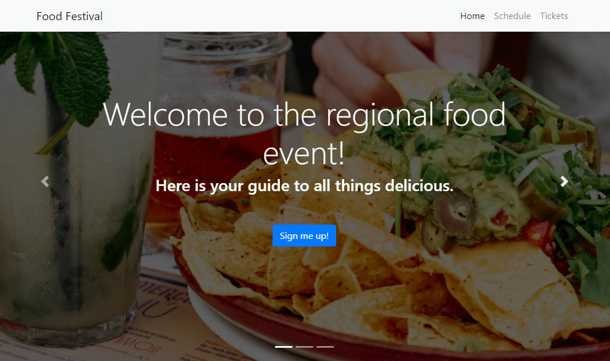
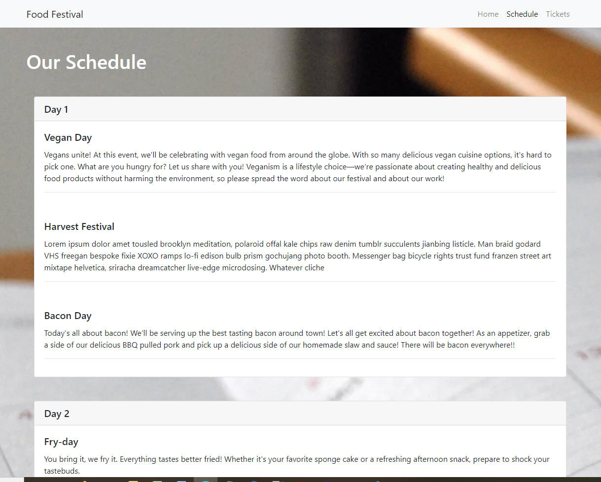
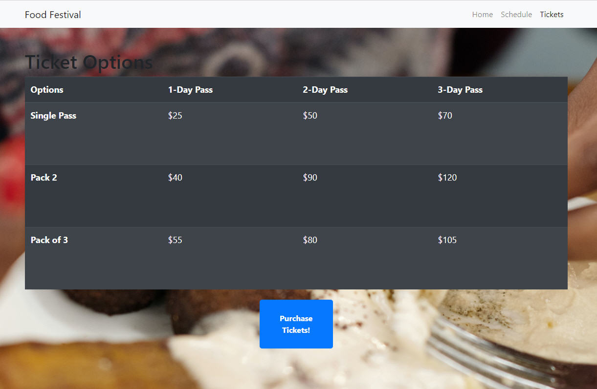

# food-festival

## Description

The goal for this project is to do the following tasks for an existing web application called "Food Festival". This application is designed for event attendees who will be using it on their phones.

1. The user needs a fast and permanent application, especially on mobile devices. The application loads very slowly when users simulates a 4G internet connection using Chrome DevTools.
2. The application needs to be turned into a PWA, or Progressive Web Application. PWAs resemble native mobile apps and allow users to interact with the application even when there is no internet connection or cell service.
3. Deploy this application on Github.

## Table of Contents

* [Description](#description)
* [Table of Contents](#table-of-contents)
* [Technologies](#technologies)
* [Tasks List](#tasks-list)
* [Usage and Test](#usage-and-tests)
* [License](#license)
* [Contributing](#contributing)
* [Screenshots](#screenshots)
* [Deploye Application](#deployed-application)
* [Questions](#questions)

## Technologies

* Lighthouse
* Webpack and webpack-cli
* Service workers
* Webpack-pwa-manifest

## Tasks List

- [x] As a user, we want to view the application from a browser.
- [x] As a user, we want the application to load quickly.
- [x] As a user, we want to use the application even if we don't have an internet connection.
- [x] As a user, we want to download the app to the home screen on our mobile devices.

## Usage and Tests

You can view this application using the following link: [Deployed App](https://sshahram.github.io/food-festival/)

To test the application performance follow these steps:

* Open Chrome DevTools and click on the "Lighthouse" tab. Then, click "Generate report". This report shows the performance of this application through different metrics.

* To check if this application works in an offline mode, open "Chrome DevTools" and click on the "Network" tab. Find "Throttling" drop-down, and select "Offline". Now try navigating from homepage of the site to "Schedule" and "Tickets" pages. These pages will be served from the caches of the browser, thus allowing us to use the application without network connectivity. Note that you will not see any of the images when you are offline, because we did not stash them in the caches with our routine.

* You can install the application on your desktop or mobile device by following these steps:
    1. At the top right of the address bar, click install "+".
    2. Follow the onscreen instructions to intall PWA.

## License

[MIT](https://choosealicense.com/licenses/mit/)

## Contributing

Pull requests are welcome. For major changes, please first open an issue to discuss what you would like to change.

## Screenshots

Please see below pictures for the snapshots of this web application:

* Homepage:

* Schedule:

* Tickets

## Deployed Application

Please use the following link to view the deployed application on GitHub: [Deployed App](https://sshahram.github.io/food-festival/)

## Questions

If you have any questions please use the following two links to contact me:

* [GitHub](https://github.com/sshahram)

* [Email Address](mailto:shirin.shahram23@gmail.com)